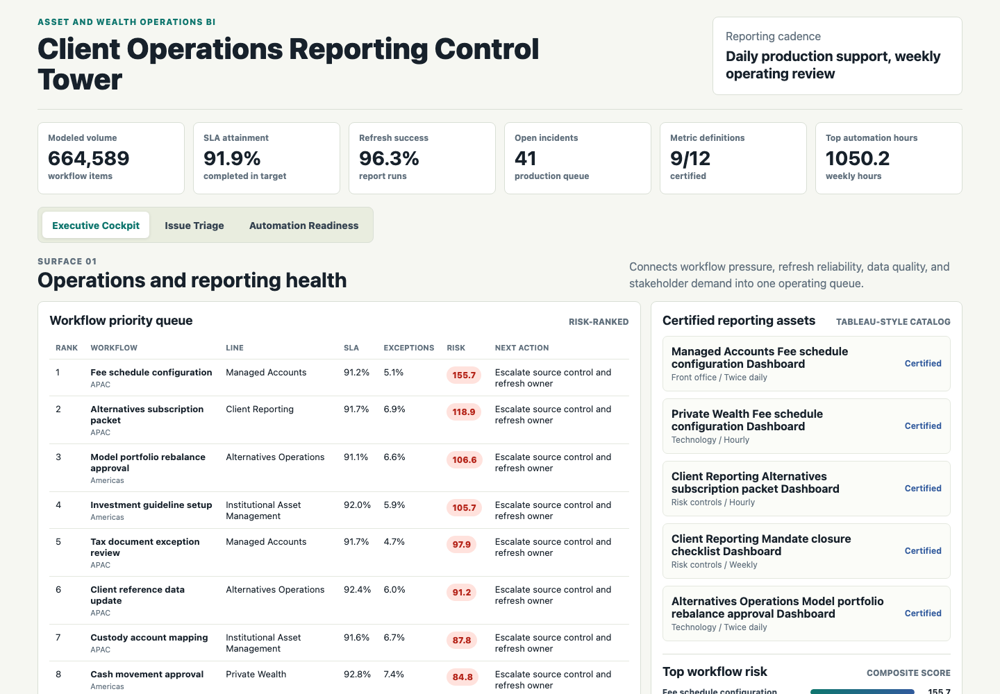
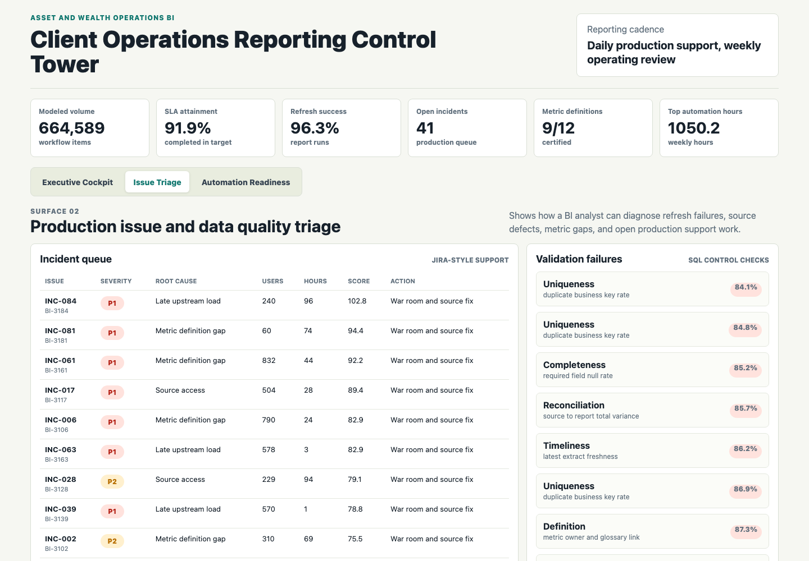
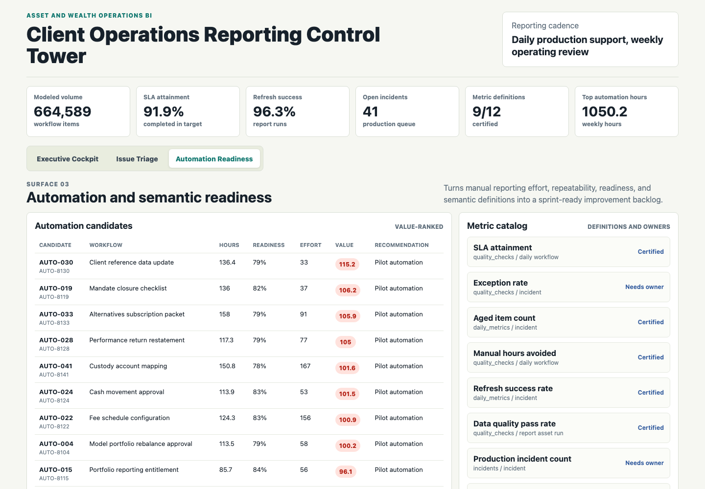

# Asset and Wealth BI Automation Workbench

An interactive BI operations portfolio artifact for an asset and wealth management operations team. The workbench shows how a data analytics analyst can support recurring Tableau-style reporting, validate SQL-backed metrics, triage production reporting issues, and convert manual workflow pain into automation-ready Jira work.



**Executive BI cockpit:** Summarizes workflow volume, SLA attainment, exception rate, refresh health, data quality, production incidents, and the highest-risk operations workflows for weekly review.



**Production issue triage:** Ranks BI incidents by severity, impacted users, age, root cause, and related quality risk so analyst time goes to the reporting problems that can disrupt operations.



**Automation and semantic readiness:** Prioritizes automation candidates using manual hours, repeatability, data readiness, downstream usage, and build effort, while showing the semantic metric catalog needed for trusted self-service reporting.

## What This Project Demonstrates

- Python data generation and scoring for a BI operations workflow.
- SQL validation checks for SLA, exception rate, refresh reliability, data quality, incident queues, and automation readiness.
- Tableau-style semantic definitions for KPI ownership and dashboard certification.
- Production support thinking across refresh failures, source latency, data defects, metric definition gaps, and stakeholder requests.
- Automation prioritization that translates manual reporting work into a sprint-ready backlog.

## Data

All data is synthetic and generated by `scripts/score_operating_data.py` with a fixed random seed. Real asset and wealth client operations data, Tableau usage data, Jira queues, report refresh logs, and workflow automation records are private, so this project models the structure of that environment without representing any real company performance.

The generator creates:

- 42 client operations workflows across business lines, regions, owners, and platforms.
- 5,040 daily workflow metric rows with volume, SLA, exceptions, rework, manual hours, quality, freshness, and report views.
- 22 Tableau-style report assets and 990 refresh run records.
- 126 data quality checks across completeness, reconciliation, timeliness, uniqueness, and metric definition controls.
- 90 production BI incidents and 104 stakeholder reporting requests.
- 42 automation candidates and ranked outputs for workflow risk, issue triage, and automation readiness.

The synthetic distributions are shaped around common operational reporting patterns: higher workflow complexity increases exception and rework exposure, larger source counts increase freshness and refresh risk, unclear metric ownership increases certification risk, and automation value depends on manual effort, repeatability, data readiness, downstream usage, and build effort.

Current generated summary:

- 664,589 modeled workflow items.
- 91.9% SLA attainment.
- 6.5% exception rate.
- 96.3% report refresh success.
- 92.3% data quality pass rate.
- 41 open production BI incidents.
- 1,050.2 weekly manual hours represented by the top eight automation candidates.

## Role Relevance

This artifact is built for a data analytics or BI analyst role supporting asset and wealth management operations. It emphasizes the work behind trusted reporting: Python automation, SQL validation, Tableau-style metric definitions, production issue resolution, stakeholder communication, and workflow automation. The workbench is intentionally more than a visual dashboard because the role requires maintaining reporting logic and improving operating workflows, not only presenting charts.

## Project Structure

- `index.html`, `src/app.js`, `src/styles.css`: Static interactive BI workbench with three distinct surfaces.
- `scripts/score_operating_data.py`: Deterministic synthetic data generator and scoring pipeline.
- `data/`: Source-style synthetic CSVs.
- `analysis/outputs/`: Ranked workflow, issue, automation, and app payload outputs.
- `analysis/sql_checks.sql`: SQL checks for recurring reporting validation.
- `analysis/tableau_measure_catalog.md`: Tableau-style metric catalog.
- `analysis/executive_findings.md`: Short stakeholder-ready findings.
- `analysis/methodology.md`: Scoring assumptions and defensibility notes.
- `data_dictionary.md`: Table grains and field purpose.

## Scope

This is a public portfolio artifact, not a production reporting system. It does not connect to real client records, financial accounts, Tableau Server, Jira, warehouse tables, live reporting jobs, or private operational data. It does show how a BI analyst can structure synthetic source data, validate recurring metrics, triage production issues, and communicate automation priorities in a defensible operating workflow.

## Run Locally

```bash
npm run analyze
npm run start
```
